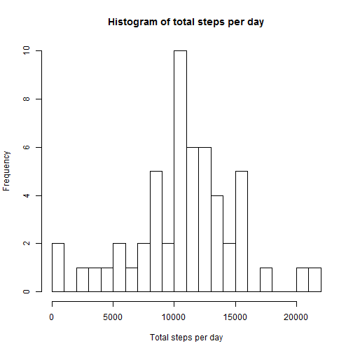
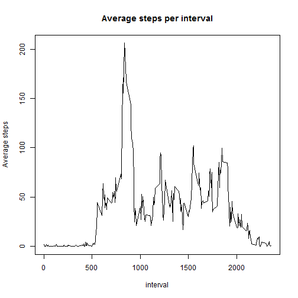
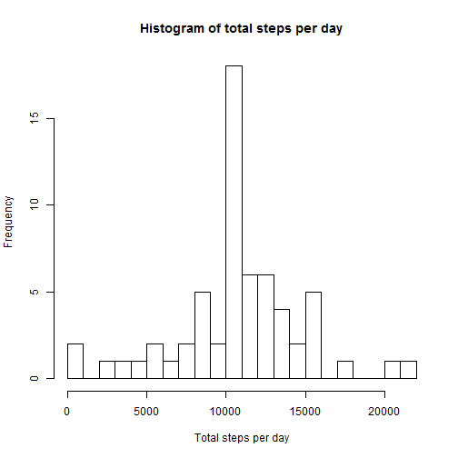
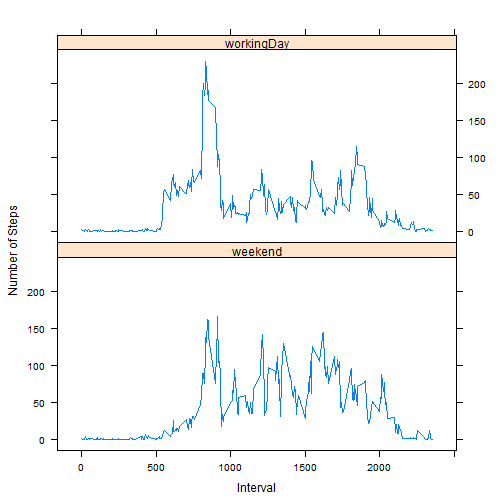

## Introduction

This is an R Markdown document to analyse data from a personal activity monitoring device. This device collects data at 5 minute intervals through out the day. The data consists of two months of data from an anonymous individual collected during the months of October and November, 2012 and include the number of steps taken in 5 minute intervals each day.

The data for this assignment can be downloaded from the course web site:

Dataset: (Activity monitoring data)[https://d396qusza40orc.cloudfront.net/repdata%2Fdata%2Factivity.zip]
The variables included in this dataset are:

steps: Number of steps taking in a 5-minute interval (missing values are coded as NA)

date: The date on which the measurement was taken in YYYY-MM-DD format

interval: Identifier for the 5-minute interval in which measurement was taken

The dataset is stored in a comma-separated-value (CSV) file and there are a total of 17,568 observations in this dataset.

## Loading and processing data

```r
setwd("D:\\Cursos\\Coursera\\DataScience\\Reproducible_Research\\week2")
library(plyr)
# Read file
activity<-read.csv("activity.csv")
```

Remove NA

```r
#Remove NA
activityClean<-na.omit(activity)
```

## Aggregate steps per day and plot an histogram

```r
perDay<-aggregate(cbind(steps,interval)~date,data=activityClean,FUN=sum)
stepsPerDay<-as.numeric(perDay$steps)
hist(stepsPerDay,breaks=25,main="Histogram of total steps per day",xlab="Total steps per day")
```



```r
meanSteps<-mean(stepsPerDay)
medianSteps<-median(stepsPerDay)
```
The mean and median of steps are, respectively:


```r
meanSteps
```

```
## [1] 10766.19
```

```r
medianSteps
```

```
## [1] 10765
```

## Daily activity

 1. Make a time series plot (i.e. type = "l") of the 5-minute interval (x-axis) and the average number of steps taken, averaged across all days (y-axis)

```r
b<-aggregate(cbind(steps,date)~interval,data=activityClean,FUN=mean)
plot(x=b$interval,y=b$steps,type="l",xlab="interval",ylab="Average steps",main="Average steps per interval")
```



  2. Which 5-minute interval, on average across all the days in the dataset, contains the maximum number of steps?
  
  The 5-minute interval that contains the maximum number of steps is:
  
  ```r
  b$interval[b$steps==max(b$steps)]
  ```
  
  ```
  ## [1] 835
  ```
  
### Calculate number of NA and replace them:

Number of NA:


```r
sum(is.na(activity)==TRUE)
```

```
## [1] 2304
```

Devise a strategy for filling in all of the missing values in the dataset. The strategy does not need to be sophisticated. 

In my case, I replace NA's by the average number of steps in interval:


```r
replaceNA<-function(x,y)
{
  if(is.na(x))
  {
    return(y)
  }
  return(x)
}
activityFull<-activity
stepsFull<-mapply(replaceNA,activity$steps,b$steps)
activityFull$steps<-stepsFull
```

Make a histogram of the total number of steps taken each day and Calculate and report the mean and median total number of steps taken per day. Do these values differ from the estimates from the first part of the assignment? What is the impact of imputing missing data on the estimates of the total daily number of steps?


```r
perDayFull<-aggregate(cbind(steps,interval)~date,data=activityFull,FUN=sum)
stepsPerDayFull<-as.numeric(perDayFull$steps)
hist(stepsPerDayFull,breaks=25, main="Histogram of total steps per day",xlab="Total steps per day")
```



The mean and median of number of steps are, respectively:


```r
mean(stepsPerDayFull)
```

```
## [1] 10766.19
```

```r
median(stepsPerDayFull)
```

```
## [1] 10766.19
```

Since we fill the number of steps for some days with the average value, the average is not changed and the median is closer to average value.

###Daily pattern

####Are there differences in activity patterns between weekdays and weekends?

First, we will add a column with the type of day (weekend or working day). Since my R installation is in spanish, I use also day names in spanish.

```r
weekdays<-weekdays(as.Date(activityFull$date))
weekdays[weekdays=="saturday"]<-"weekend"
weekdays[weekdays=="sábado"]<-"weekend"
weekdays[weekdays=="domingo"]<-"weekend"
weekdays[weekdays=="sunday"]<-"weekend"
weekdays[weekdays!="weekend"]<-"workingDay"
activityFull$day<-weekdays
```

Since we do not need dates anymore we will remove the date column.


```r
# Remove dayt column
activityFull$date<-NULL
```

Now, we will calculate the average number of steps per interval and day type. We will plot the average number of steps per interval both for weekend days and working days.


```r
perDayTypeMean<-ddply(activityFull,c("day","interval"),summarise,mean=mean(steps))
library(lattice)
xyplot(mean~interval | day, data = perDayTypeMean,
      type = 'l',
      xlab = 'Interval',
      ylab = 'Number of Steps',
      layout = c(1,2))
```


